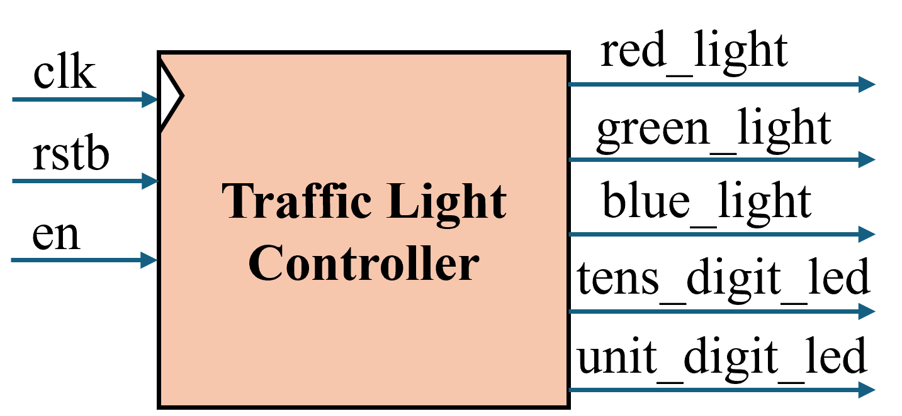
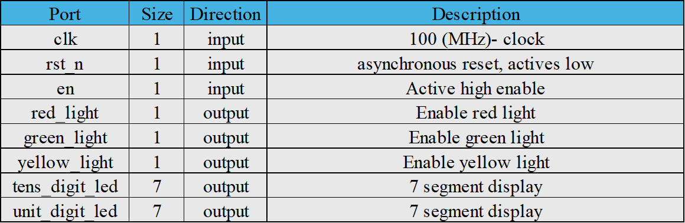
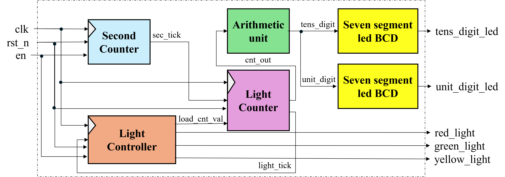
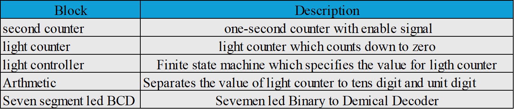
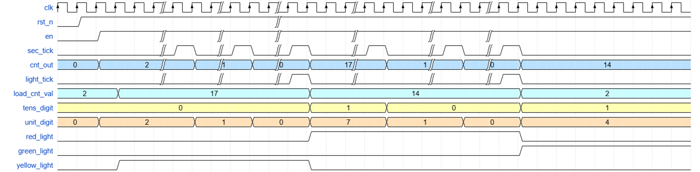

# FPGA Traffic Light Controller (Verilog | Basys 3 Artix-7)

## Overview

This project implements a real-time traffic light controller on FPGA using Verilog HDL.
The system controls a 4-way intersection through a synchronous finite state machine (FSM) driven entirely by hardware timers (no software delays).

The design is implemented and tested on a Xilinx Artix-7 FPGA and verified using simulation waveforms.

**Objectives**

* Practice synchronous digital design
* Implement timing using clock division
* Design a Moore FSM controller
* Perform functional verification using testbench

---

## Repository Structure

```
Traffic_Light/
 ├── Diagram_Picture/   # Block diagram and FSM diagram
 ├── RTL/               # Synthesizable Verilog modules
 ├── testbench/         # Simulation testbench
 ├── wave/              # Simulation waveform results
 └── README.md
```

---

## Hardware Platform

* FPGA: Xilinx Artix-7 (Basys 3)
* Clock: 50 MHz onboard oscillator
* Outputs: LEDs simulate traffic lamps
* Toolchain: Vivado + ModelSim

---

## Design Architecture

The system is divided into 5 main blocks:

1. **Clock Divider**

   * Converts 50 MHz system clock → 1 Hz tick

2. **Light Counter**

   * Counts duration of each traffic state

3. **Light Controller**

   * Controls traffic signal transitions

4. **7-segment Led BCD**

   * Drives traffic LEDs
   
5. **Artithmetic Unit**

   *Separate the tens and units digits.

## Block diagram
block diagram availabe in: 
```
/Diagram_Picture
```
High level block diagram is presented in this below: 
<p align="center">
  
</p>
---
<p align="center">
  
</p>

Low level block diagram of Traffic Light: 

<p align="center">
  
</p>  

The details of each block are illustrated below:

<p align="center">
  
</p>

We also draw expected waveform which is represented below : 

<p align="center">
  
</p>

### Second Counter ( Clock Divider ) 

The second Counter converts 50MHz of system clock in FPGA to 1Hz tick : 
$$
1\text{ Hz tick} = \frac{100\,MHz}{100,000,000}
$$


## FSM Description

The controller follows a Moore FSM architecture.


State transitions occur only when the hardware timer expires.

FSM diagram:

```
/Diagram_Picture
```

---

## Timing Configuration

Timing is parameterized inside the design:

```verilog
parameter GREEN_TIME  = 10;
parameter YELLOW_TIME = 3;
```

The durations are generated using a 1-second tick derived from the 100 MHz FPGA clock.

---

## Simulation & Verification

Simulation performed using ModelSim.

Testbench verifies:

* Correct state transitions
* Correct timing duration
* Proper reset behavior
* No glitching outputs

Testbench location:

```
/testbench
```

Waveform results:

```
/wave
```

---

## How to Run

1. Open Vivado
2. Create project
3. Add files from `/RTL`
4. Add constraint file
5. Run synthesis → implementation → bitstream
6. Program FPGA

Simulation:

* Run testbench in ModelSim using files in `/testbench`

---

## Learning Outcomes

Through this project I learned:

* Designing synchronous FSM in Verilog
* Implementing precise timing using hardware counters
* Avoiding combinational timing hazards
* Writing verification testbench
* Understanding difference between software delay and hardware timing

---

## Future Improvements

* Pedestrian button
* Adaptive traffic based on sensors
* UART configurable timing
* AXI interface (for SoC FPGA)

---

## Author

**Thang Tran**
FPGA / Digital Design Enthusiast
